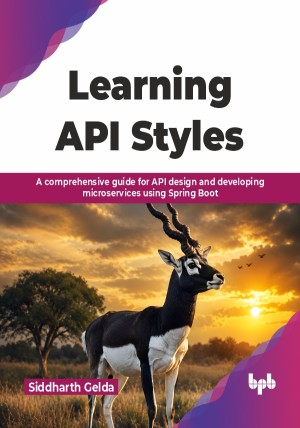

# Learning API Styles

A comprehensive guide for API design and developing microservices using Spring Boot

This is the repository for [Learning API Styles](https://bpbonline.com/products/learning-api-styles?variant=45121738178760), published by BPB Publications. The code bundles of this book are available here: https://rebrand.ly/3da0d7

## About the Book
Application programming interfaces are a key part of software development, enabling communication between applications and services. This book provides a practical understanding of API concepts, covering API design, API styles, API tools, microservices, security, and practical implementation approaches. 

The book introduces transmission model approaches, including pull model, push model, and streaming, along with legacy system issues. It also covers endpoint design, URI, URL, HTTP methods, and status codes. Readers will explore SOAP-based API, REST API, GraphQL, RPC, WebSocket, Webhooks, and API tools such as Swagger, SDKs, stubs, Postman, and Karate Labs. The book further explores microservices architecture, covering service communication, data modelling, resilience, governance, management, and platform concepts. It introduces advanced patterns including CQRS, SAGA pattern, BFF, and service mesh, along with API performance and security concepts such as Basic Auth, OAuth 2.0, JWT, API keys, and Transport Layer Security. 

By the end of this book, the readers will be able to evaluate API technologies confidently, design and evolve APIs with empathy for consumers, and create API ecosystems that scale with product needs and team maturity.

## What You Will Learn
•	 Overview of API styles like REST, GraphQL, gRPC, WebSockets, and Webhooks.

•	 Learn how different styles handle CRUD, filtering, error handling, and pagination.

•	 Apply OpenAPI, GraphQL SDL, Protocol Buffers, and AsyncAPI for contract design.

•	 Learn advanced patterns including CQRS, SAGA pattern, BFF, and service mesh. 

•	 Understand API performance through OAuth 2.0, JWT, and TLS implementation. 

•	 Build practical solutions using Java 21, Spring Boot 3, and practical use cases. 
